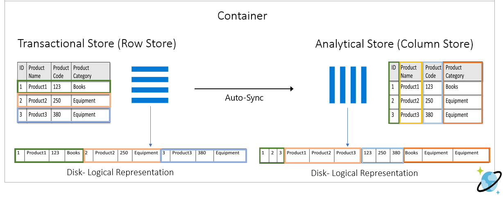
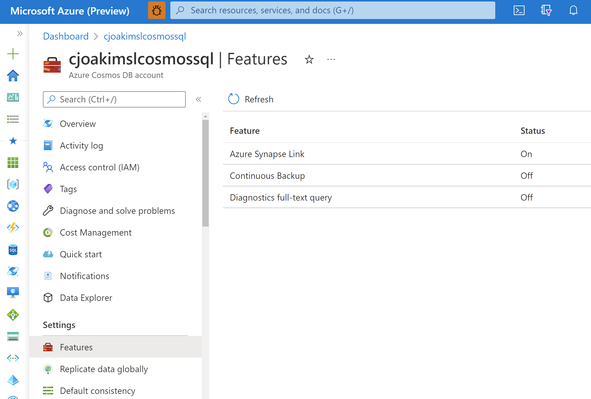
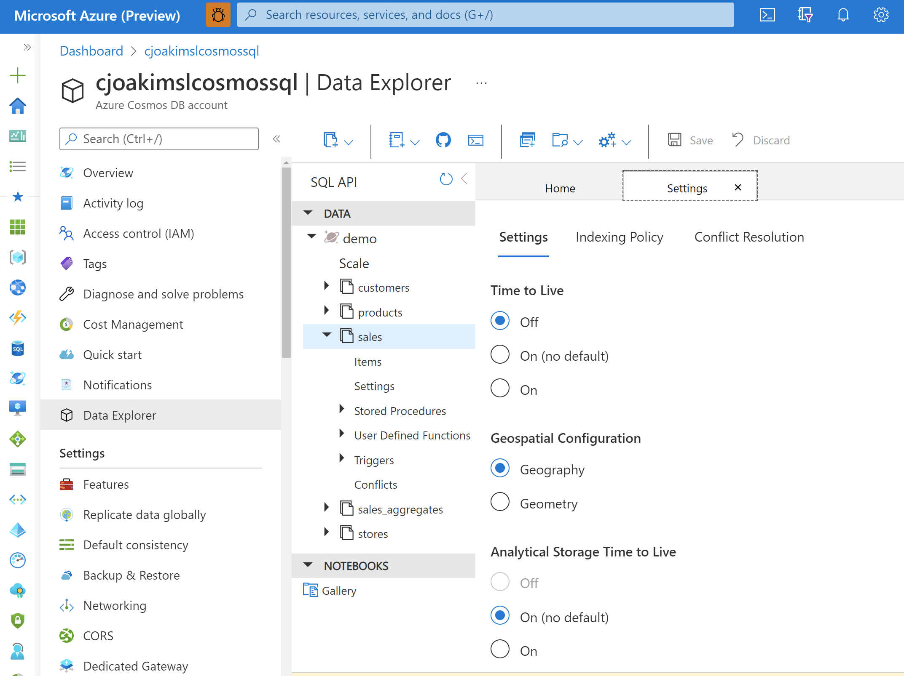
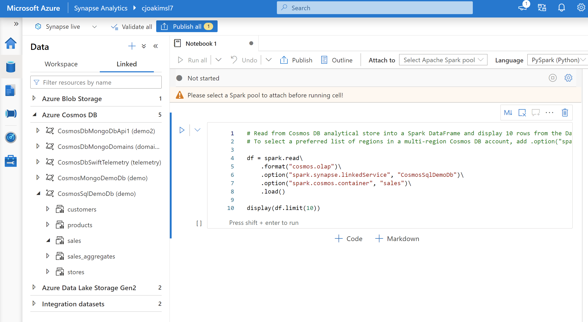
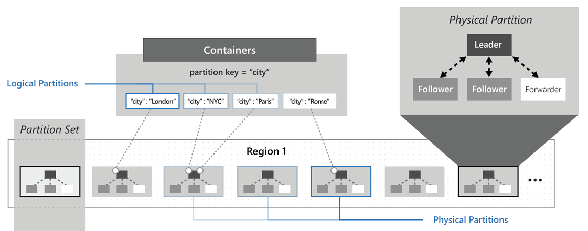
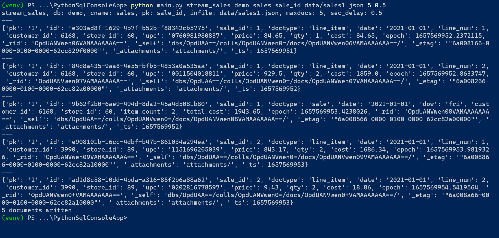
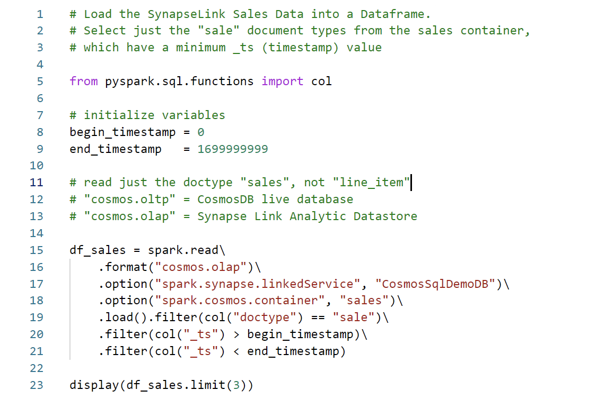
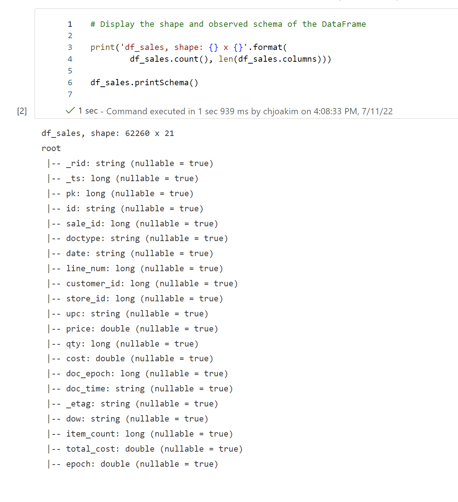
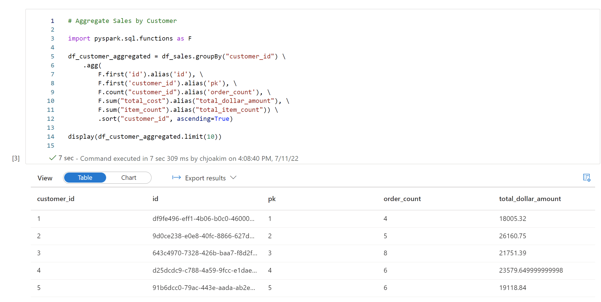
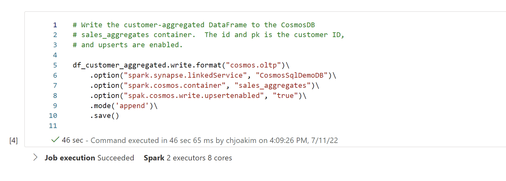

# Azure CosmosDB with Synapse Link Presentation

Demonstration of **Azure CosmosDB** and **Azure Synapse Analytics**
integration via **Synapse Link**

**Chris Joakim, Microsoft, Global Black Belt (GBB) for NoSQL/CosmosDB**, chjoakim@microsoft.com

The intent of this GitHub repository is both for **presentation purposes** and **working code examples**

Repository URL: https://github.com/cjoakim/azure-cosmosdb-synapse-link

Presentation URL: https://github.com/cjoakim/azure-cosmosdb-synapse-link/blob/main/Presentation/presentation.md

<p align="center"></p>

<a name="part1"></a>

## What is HTAP?

- **Origins of the term HTAP per Wikipedia**
  - **HTAP** = **Hybrid Transactional Analytical Processing**
  - https://en.wikipedia.org/wiki/Hybrid_transactional/analytical_processing
    - **Gartner** in 2014 coined the phrase **HTAP**
      - "... architecture that "breaks the wall" between transaction processing and analytics."
    - **Forrester** called it **HOAP**
      - "Hybrid Operational and Analytical Processing"

### Why use HTAP?

  - It Enables:
    - Efficient use of the operational database (OLTP)
    - Efficient analytics and batch processing on copies of the same data
    - "Painless ETL"
    - Use of the right tool for the job; OLTP vs OLAP
    - **Lower Overall System Costs**

<p align="center"></p>

## Architecture of Azure Synapse Link

- **Hybrid Transactional and Analytical Processing (HTAP) Implementation in Azure**
  - Data flows from CosmosDB to the Analytic Store in approximately 2-minutes; **no ETL required**
  - Azure Cosmos DB guarantees **performance isolation** between the transactional and analytical workloads
  - The Analytic Store is **read-only from Azure Synapse**
  - The account can be either **CosmosDB/SQL** or **CosmosDB/Mongo**; this repo demonstrates both 
  - The solution is **very easy to configure and use**
  - Use the **Apache Spark** and/or **SQL** compute engines in Azure Synapse to read the Analytic Store
  - References:
    - [Azure CosmosDB](https://docs.microsoft.com/en-us/azure/cosmos-db/introduction)
    - [Azure Synapse Analytics](https://docs.microsoft.com/en-us/azure/synapse-analytics/)
    - [Azure Synapse Link](https://docs.microsoft.com/en-us/azure/cosmos-db/synapse-link)
    - [A Common Use-Case](https://docs.microsoft.com/en-us/azure/cosmos-db/synapse-link-use-cases)

<p align="center">
    
</p>

### Synapse Link data movement and transformation

- Synapse Link performs **both copy AND data transformation (to columnar format)** operations
- A **columnar datastore**, similar to Apache Parquet, is more suitable for analytical processing
- The **inserts, updates, and deletes** to your CosmosDB operational data are automatically synced to the analytical store

<p align="center">
  
</p>

<p align="center"></p>

## Configure CosmosDB

### Enable the Synapse Link Feature on the Account

<p align="center">
    
</p>

### Also Enable Synapse Link per Container

<p align="center">
    
</p>

Note the optional **TTL** functionality in both OLTP and OLAP.

<p align="center"></p>

## Configure a Linked Service in Azure Synapse

First, create a **Linked Service** in Azure Synapse.  This is the sequence of steps in the UI:

```
In Synapse Studio
  Linked Services -->
    New Linked Service -->
      Select CosmosDB -->
        Select your Subscription -->
          Select your Database -->
            Test Connection -->
              Save
```

This is the resulting list of **Datasets** in Azure Synapse (see the CosmosSqlDemoDB linked service):

<p align="center">
    
</p>

### Spark Notebook Code to Read the Synapse Link Data

Right-mouse a dataset (i.e. - sales) to produce an initial working notebook:

```
df = spark.read\
    .format("cosmos.olap")\
    .option("spark.synapse.linkedService", "CosmosSqlDemoDb")\
    .option("spark.cosmos.container", "sales")\
    .load()
```

<p align="center"></p>

## The Demonstration Application

- A **Client Console Application** reads a data file, and **Loads JSON documents to CosmosDB**
  - See example [DotnetSqlConsoleApp](../DotnetSqlConsoleApp/readme.md) for bulk-loading **CosmosDB/SQL**
  - See example [JavaMongoConsoleApp](../JavaMongoConsoleApp/readme.md) for loading **CosmosDB/Mongo**
  - See example [PythonMongoConsoleApp](../PythonMongoConsoleApp/readme.md) for loading **CosmosDB/Mongo**
  - See example [PythonSqlConsoleApp](../PythonSqlConsoleApp/readme.md) for loading **CosmosDB/SQL**
  - See the [dataset_generation](../dataset_generation/readme.md) directory
    - **Simulated Products, Stores, Customers, and Sales documents with Line Items**
    - Both the **Sale** and **LineItem** documents are written to the **same container: Sales**
      - The sale_id is the **partition key value**, not the customer_id
    - **Use-Case is to Aggregate the Sales by Customer**
      - This is relatively expensive to do in CosmosDB, since the customer_id is not the partition key
    - The simulated data was generated with Python and the **faker** library

### CosmosDB Horizontal Partitions and Partition Keys

<p align="center">
    
</p>

### Sample Sale Document

```
{
    "pk": 106,
    "id": "aad1d9b6-58df-4b2b-840d-e79f776544a7",
    "sale_id": 106,
    "doctype": "sale",
    "date": "2021-01-02",
    "dow": "sat",
    "customer_id": 3320,
    "store_id": 67,
    "item_count": 2,
    "total_cost": 2000.65,
    "doc_epoch": 1644166322264,
    "doc_time": "2022/02/06-16:52:02",
    "_rid": "OpdUANVwen0CAAAAAAAAAA==",
    "_self": "dbs/OpdUAA==/colls/OpdUANVwen0=/docs/OpdUANVwen0CAAAAAAAAAA==/",
    "_etag": "\"95051d3a-0000-0100-0000-61fffcb30000\"",
    "_attachments": "attachments/",
    "_ts": 1644166323
}
```

### Sample LineItem Docment

```
{
    "pk": 106,
    "id": "7b7a8f27-f784-4915-9b65-3d8fb81d8264",
    "sale_id": 106,
    "doctype": "line_item",
    "date": "2021-01-02",
    "line_num": 1,
    "customer_id": 3320,
    "store_id": 67,
    "upc": "1357012779868",
    "price": 852.67,
    "qty": 1,
    "cost": 852.67,
    "doc_epoch": 1644166322264,
    "doc_time": "2022/02/06-16:52:02",
    "_rid": "OpdUANVwen0DAAAAAAAAAA==",
    "_self": "dbs/OpdUAA==/colls/OpdUANVwen0=/docs/OpdUANVwen0DAAAAAAAAAA==/",
    "_etag": "\"95051e3a-0000-0100-0000-61fffcb30000\"",
    "_attachments": "attachments/",
    "_ts": 1644166323
}
```

### Send a Stream of Sales data to CosmosDB with the PythonSqlConsoleApp

```
python main.py stream_sales demo sales sale_id data/sales1.json 999999 0.5
```

<p align="center">
    
</p>

- The CosmosDB data flows into **Synapse Link Analytical Store in near realtime**
  - Approximately 2-minutes
  - https://docs.microsoft.com/en-us/azure/cosmos-db/analytical-store-introduction
  - https://docs.microsoft.com/en-us/azure/cosmos-db/synapse-link-frequently-asked-questions

- Synapse Link performs **both copy AND data transformation (to columnar format)** operations

- No other **ETL** solution is needed (i.e. - Databricks)

- **Time To Live (TTL)** is enabled on both the transactional and analytical stores
  - https://docs.microsoft.com/en-us/azure/cosmos-db/sql/time-to-live
  - https://docs.microsoft.com/en-us/azure/cosmos-db/configure-synapse-link
  - https://docs.microsoft.com/en-us/azure/cosmos-db/analytical-store-introduction#analytical-ttl
  - https://docs.microsoft.com/en-us/azure/cosmos-db/synapse-link-frequently-asked-questions

- Query the Synapse Link data with **PySpark Notebooks in Azure Synapse Analytics**
  - https://docs.microsoft.com/en-us/azure/synapse-analytics/synapse-link/how-to-query-analytical-store-spark-3
  - See the synapse/notebooks/ directory in this repo for examples; *.ipynb files

- The Synapse Link data can also be queried with **SQL pools** (not in demonstration)
  - https://docs.microsoft.com/en-us/azure/cosmos-db/synapse-link-power-bi

- A **PySpark Notebook aggregates the Synapse Link Sales data, and writes it back to CosmosDB**
  - [The PySpark Notebook Used in the Demonstration Application](https://github.com/cjoakim/azure-cosmosdb-synapse-link/blob/main/Synapse/notebooks/cosmos_sql_sales_processing.ipynb)


#### Notebook Cell 1 - Load the SynapseLink Sales Data into a Dataframe

<p align="center">
    
</p>

#### Notebook Cell 2 -  Display the shape and observed schema of the DataFrame

<p align="center">
    
</p>


#### Notebook Cell 3 - Aggregate Sales by Customer 

<p align="center">
    
</p>

#### Notebook Cell 4 - Write the customer-aggregated DataFrame to the CosmosDB sales_aggregates container

This **sales_aggregates** container is an efficient **"materialized view"** of the sales data.

<p align="center">
    
</p>

<p align="center"></p>

## Synapse Link Details

- **No impact to CosmosDB performance or RU costs**
- Is Scalable and Elastic
- The Synapse Link data can be queried in Azure Synapse Analytics by:
  - **Azure Synapse Spark pools**
    - Spark Streaming not yet supported
  - **Azure Synapse Serverless SQL pools** (not provisioned pools)
- **Pricing** consists of **storage and IO operations**
  - https://docs.microsoft.com/en-us/azure/cosmos-db/analytical-store-introduction#analytical-store-pricing
  - https://azure.microsoft.com/en-us/pricing/details/cosmos-db/
  - https://azure.microsoft.com/en-us/pricing/details/synapse-analytics/

- **Schema constraints**:
  - https://docs.microsoft.com/en-us/azure/cosmos-db/analytical-store-introduction#schema-representation
  - Only the first 1000 document properties
  - Only the first 127 document nested levels
  - No explicit versioning, the schema is inferred
  - CosmosDB stores JSON
  - Attribute names are mormalized: {"id": 1, "Name": "fred", "name": "john"}
  - Addtibute names with odd characters: colons, semicolons, parens, =, etc

- **Two Schema Types**

  - **Well-defined**
    - Default option for CosmosDB/SQL API accounts
    - The schema, with **datatypes**, grows are documents are added
      - Non-conforming attributes are ignored
        - doc1: {"id": "1", "a": 123}      <-- "a" is an integer, added to schema
        - doc2: {"id": "2", "a": "str"}    <-- "a" isn't an integer, is ignored

  - **Full Fidelity**
    - Default option for CosmosDB/Mongo API accounts
    - None of the above dataname normalization or datatype enforcement
    - Can be optionally be used by the SQL API
      - az cosmosdb create ... --analytical-storage-schema-type "FullFidelity" 

- See https://docs.microsoft.com/en-us/azure/cosmos-db/analytical-store-introduction

---

## Additional Links & References

- [What is Azure Synapse Link for Azure Cosmos DB?](https://docs.microsoft.com/en-us/azure/cosmos-db/synapse-link)
- [Azure Cosmos DB](https://docs.microsoft.com/en-us/azure/cosmos-db/introduction)
- [Azure Synapse Analytics](https://azure.microsoft.com/en-us/services/synapse-analytics/)
- [Analytical Store Pricing](https://docs.microsoft.com/en-us/azure/cosmos-db/analytical-store-introduction#analytical-store-pricing)
- [CosmosDB Change Feed](https://docs.microsoft.com/en-us/azure/cosmos-db/change-feed)

### Synapse

- [Synapse Notebooks](https://docs.microsoft.com/en-us/azure/synapse-analytics/spark/apache-spark-development-using-notebooks)
- [Synapse Apache Spark](https://docs.microsoft.com/en-us/azure/synapse-analytics/get-started-analyze-spark)
- [Analyze data in a Storage Account](https://docs.microsoft.com/en-us/azure/synapse-analytics/get-started-analyze-storage)
- [Azure-Samples/Synapse GitHub Repo](https://github.com/Azure-Samples/Synapse)

### Apache Spark

- [Apache Spark Docs](https://spark.apache.org/docs/latest/)
- [Apache Spark PySpark API Docs](https://spark.apache.org/docs/latest/api/python/reference/index.html)
