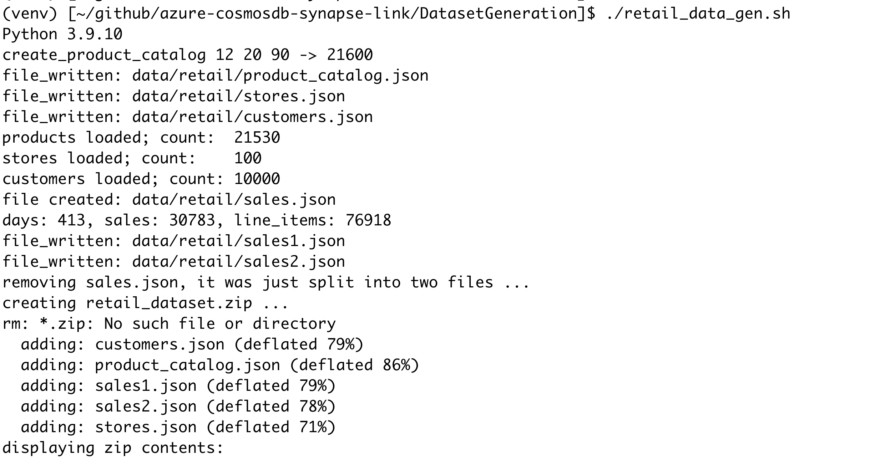
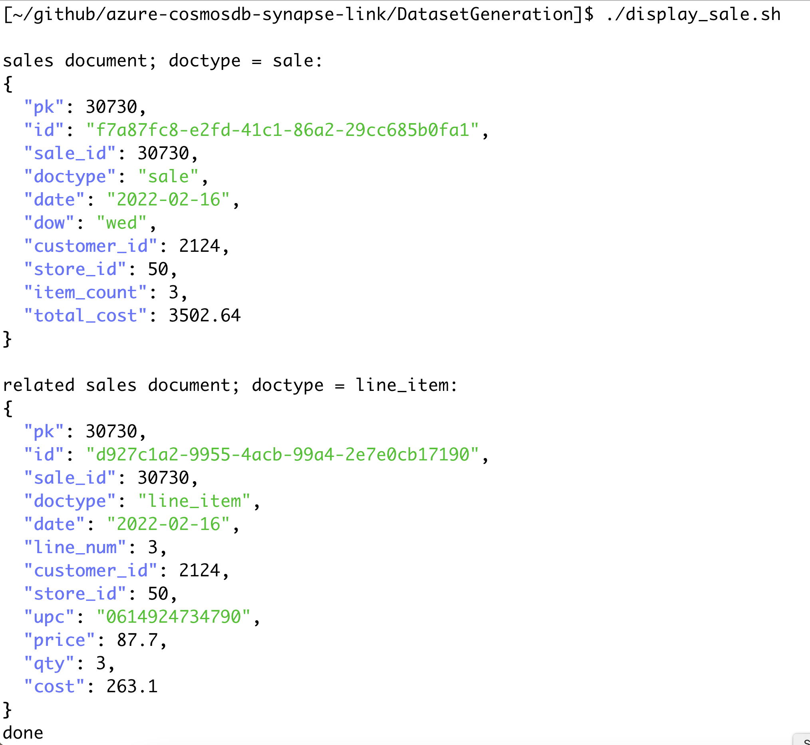
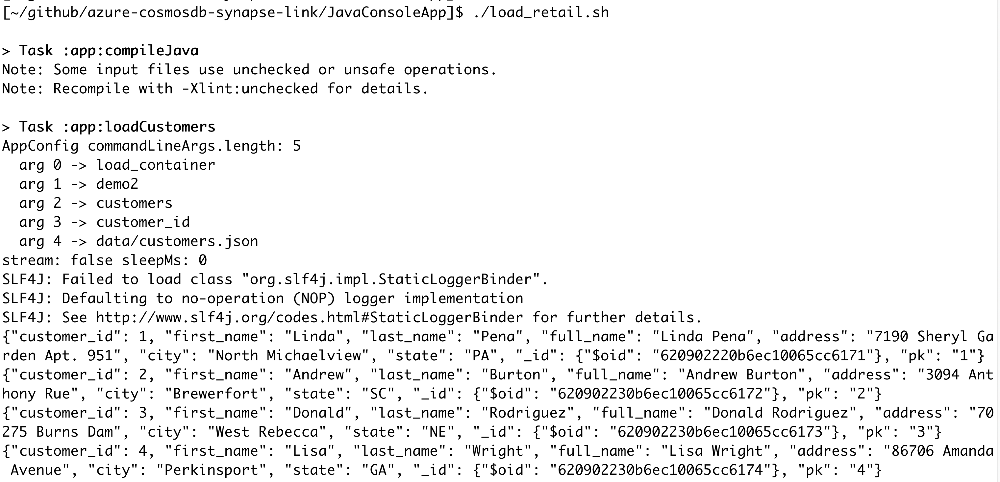
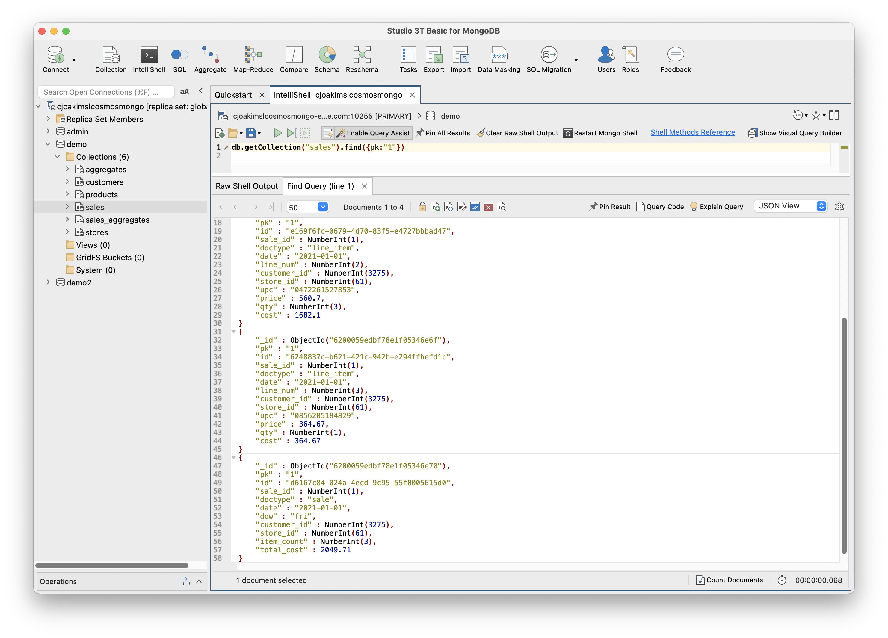
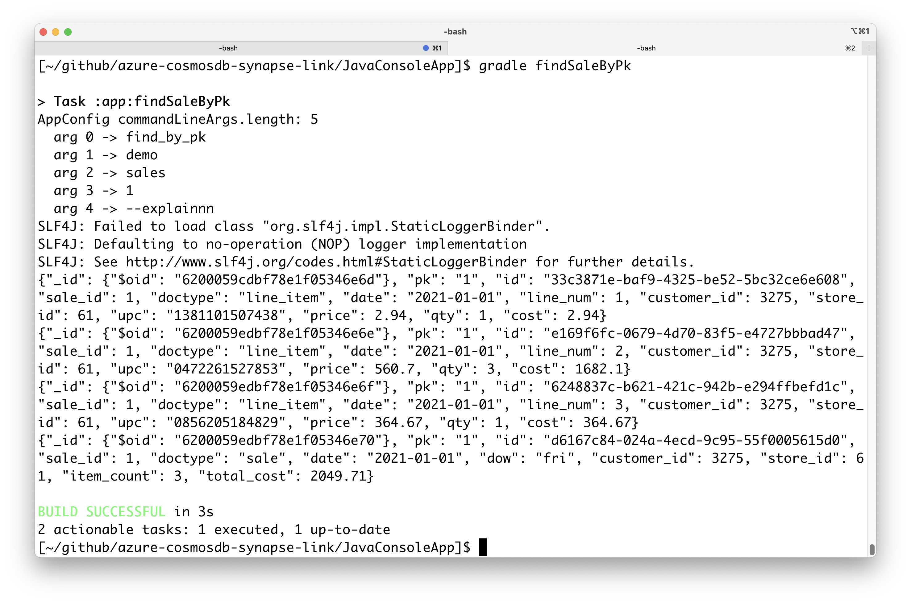
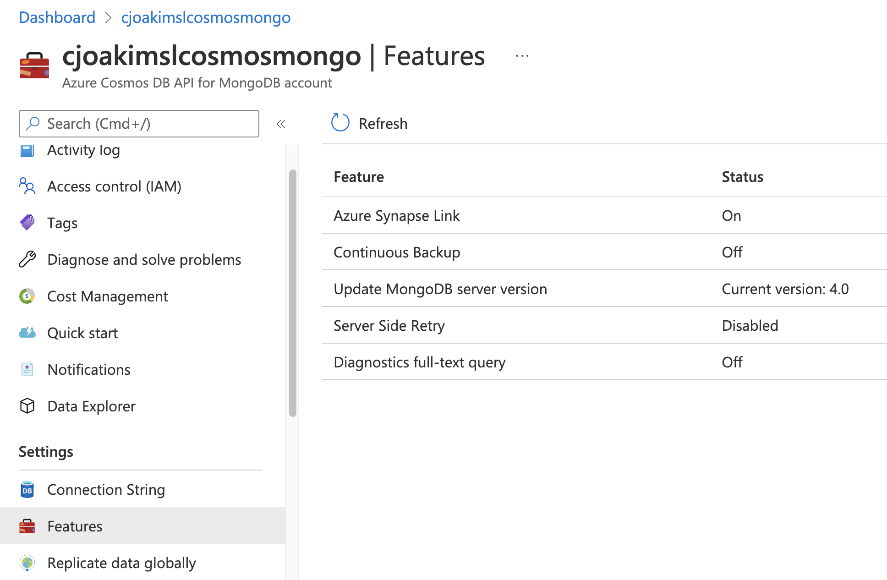
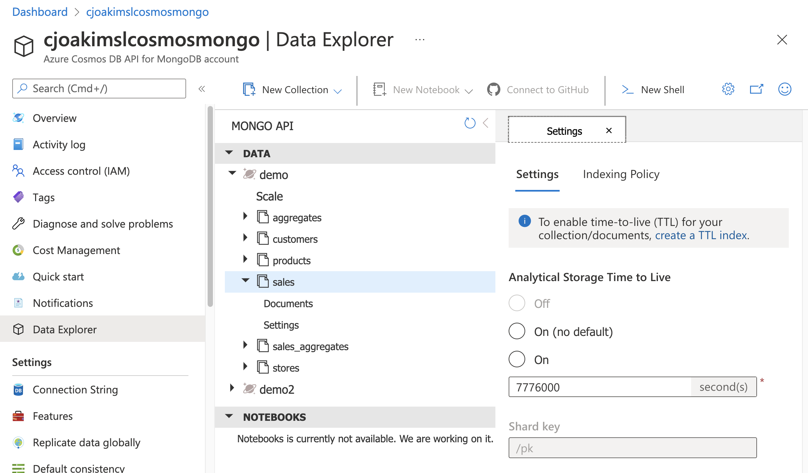
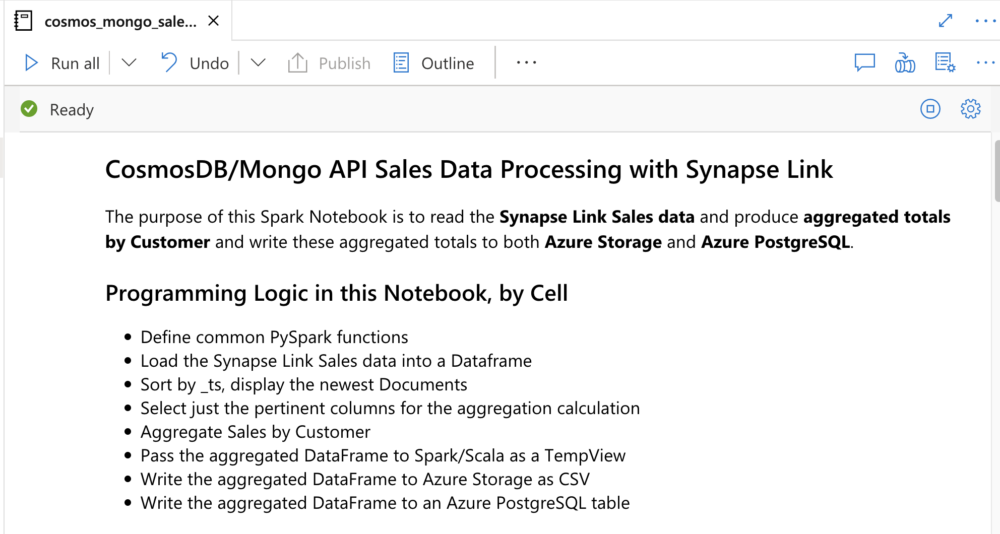
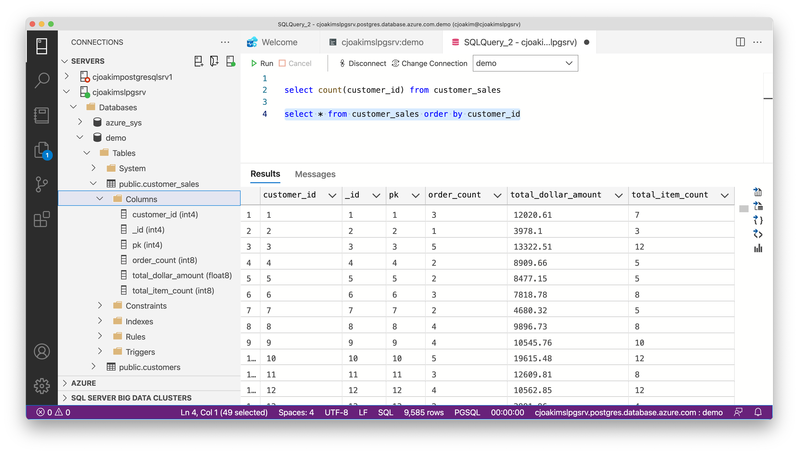

# Cosmos DB Live TV, 2022/02/17

> Chris Joakim, Microsoft, Global Black Belt NoSQL/CosmosDB

> Mark Brown, Microsoft, Principal Program Manager, CosmosDB

---

## Outline of Presentation

- **Architecture**
- **Dataset Generation with Python and Faker, Document Design**
- **Load a CosmosDB/Mongo API database with Java**
- **Query that CosmosDB/Mongo data with both Studio 3T and Java** 
- **Configure and utilize Azure Synapse Link (SL)**
- **Azure Synapse Spark Notebook - Aggregations**  
- **Azure Data Studio with PostgreSQL**

This URL: https://github.com/cjoakim/azure-cosmosdb-synapse-link/blob/main/Presentation/presentation_20220217.md

## Themes

- **MongoDB and Azure CosmosDB/Mongo API**
- **Azure Synapse Link**
- **HTAP** - Hybrid Transaction Analytical Processing
- **Open-Source and Standard tooling**
  - Python, Java, 3T, Spark
  - Also mongoexport / momgoexport, mongodump / mongorestore, Matlab
- **Free Microsoft Tooling** - Azure Data Studio, Azure Storage Explorer, VSC
- **Polyglot programming** - python, java, spark, scala, etc
- **Polyglot architecture** - CosmosDB, Synapse, Spark, Blob, PostgreSQL, etc

### Note

- Not covered today
  - Provisioning the Azure resources, see the az directory
  - CosmosDB/SQL and Synapse Link, also in this repo

---

## Presentation

- **Architecture**

<p align="center">
    
</p>

---

- **Dataset Generation with Python and Faker, Document Design**
  - Why?  To create randomized and representative data for development
    - Similar to [Lorem ipsum](https://en.wikipedia.org/wiki/Lorem_ipsum), but for Documents
    - https://www.nuget.org/packages/Faker.Net 
    - https://rubygems.org/gems/factory_girl/versions/4.9.0
  - https://faker.readthedocs.io/en/master/index.html
  - See DatasetGeneration/retail_data_gen.py, line 85 create_stores()
  - PowerShell Scripts:
    - .\retail_data_gen.ps1
    - .\retail_data_show.ps1
    - .\display_sale.ps1
  - document and container design - pk, doctype, schemaless
  - partition key joins

<p align="center"></p>

<p align="center">
    
</p>

<p align="center"></p>

<p align="center">
    
</p>

---

- **Load a CosmosDB/Mongo API database with Java**
  - see JavaConsoleApp/app/build.gradle 
  - **org.mongodb:mongodb-driver-sync:4.4.1** on mavenCentral()
  - MongoClient, MongoDatabase, MongoCollection, Document, FindIterable
  - JavaConsoleApp/app/src/main/java/org/cjoakim/cosmos/mongo/Mongo.java
  - **gradle build**          <-- Compile and jar the project
  - **gradle uberJar**        <-- Create an "uber jar" with all dependencies
  - **gradle loadSales2**     <-- load the sales data for Feb 17
  - **gradle findSaleByPk**   <-- Mongo find() query

<p align="center"></p>

<p align="center">
    
</p>

---

- **Query that CosmosDB/Mongo data with both Studio 3T and Java** 
  - use the MongoDB tools you already use - 3T, mongoimport, mongoexport, etc

```
db.getCollection("sales").find({})

db.getCollection("sales").find({pk:"1"})
```

```
gradle findSaleByPk
```

<p align="center"></p>

<p align="center">
    
</p>

<p align="center"></p>

<p align="center">
    
</p>

---

- **Configure and utilize Azure Synapse Link (SL)**
  - HTAP - Hybrid Transaction Analytical Processing
  - Beautiful integration of the Azure PaaS services - "Painless ETL"
  - See CosmosDB Account in Azure Portal
  - See Linked Services in Synapse in Azure Portal
  - Schema Types - Well Defined (CosmosDB/SQL), Full Fidelity (CosmosDB/Mongo)
  - [Synapse Setup](setup_synapse.md) 

<p align="center"></p>

<p align="center">
    
</p>

<p align="center"></p>

<p align="center">
    
</p>

---

- **Azure Synapse Spark Notebook - Aggregations** 
  - Read the Azure Synapse sales data
  - Aggregate the sales by customer
  - Write the aggregated totals to Azure Blob Storage as CSV
  - Download the CSV with Azure Storage Explorer
  - Write the aggregated totals to Azure PostgreSQL with JDBC
  - Synapse/notebooks/cosmos_mongo_sales_processing.ipynb

<p align="center"></p>

<p align="center">
    
</p>

---

- **Azure Data Studio with PostgreSQL**
  - Query the Azure Azure PostgreSQL database
  - **For Reporting, PowerBI**

```
select count(customer_id) from customer_sales

select * from customer_sales order by customer_id
```

<p align="center"></p>

<p align="center">
    
</p>

---

## GitHub Repository Map

Note: I use this repo to present and demonstrate **both** CosmosDB/SQL
with Synapse Link as well as CosmosDB/Mongo with Synapse Link.

```
├── DatasetGeneration   <-- Python/Faker code to create sales data
├── DotnetConsoleApp    <-- C# code for CosmosDB/SQL (not in this presentation)
├── JavaConsoleApp      <-- Java/Gradle app, client of CosmosDB/Mongo API
│   ├── app
├── Presentation
├── PythonConsoleApp   <-- Java/Gradle app, client of CosmosDB/Mongo API (not in this presentation)
├── Relational
│   └── PostgreSQL     <-- DDL/SQL scripts for Azure PostgreSQL
├── Synapse            <-- Azure Synapse artifacts
│   ├── conf           <-- Spark conf examples
│   ├── graphframes
│   ├── libraries      <-- jar files for Spark
│   ├── notebooks      <-- Jupyter Notebooks with PySpark and Scala
└── az                 <-- az CLI scripts for provisioning Azure resources for this demo
                           (not shown in this presentation)
```
