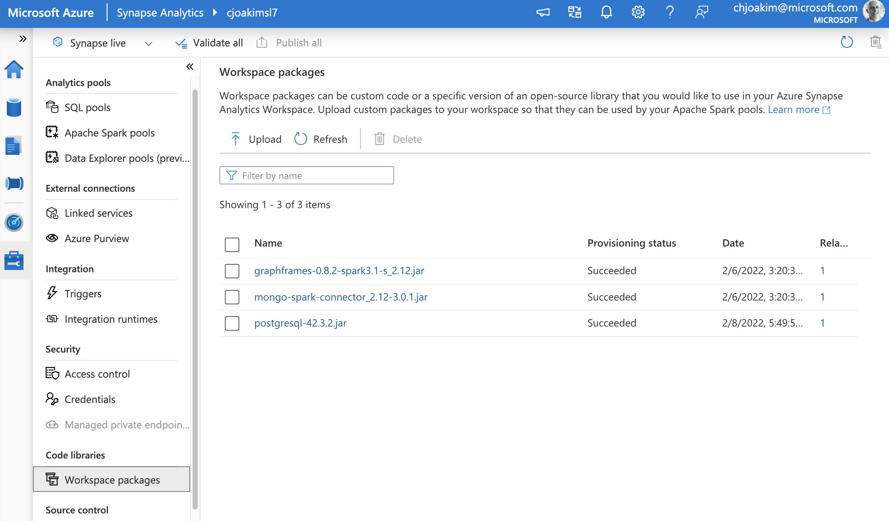
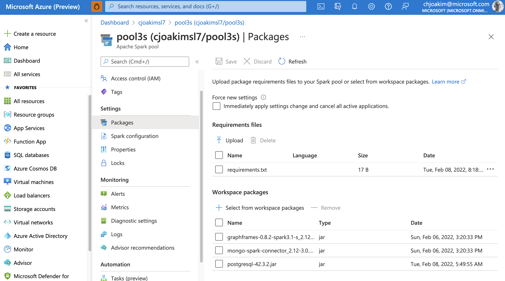
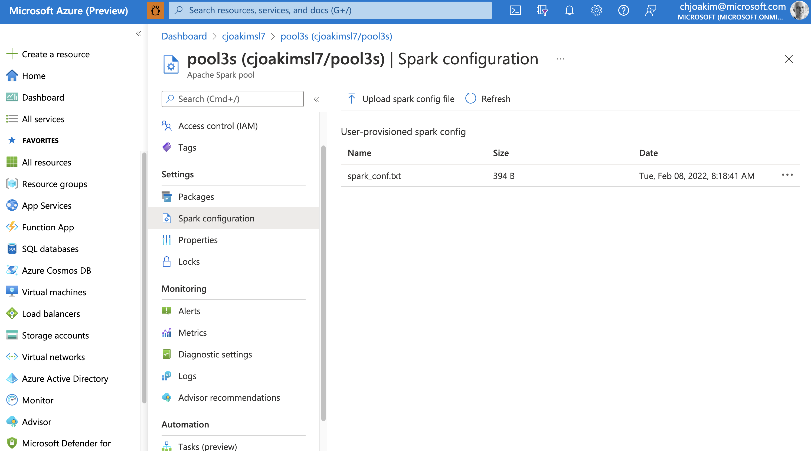
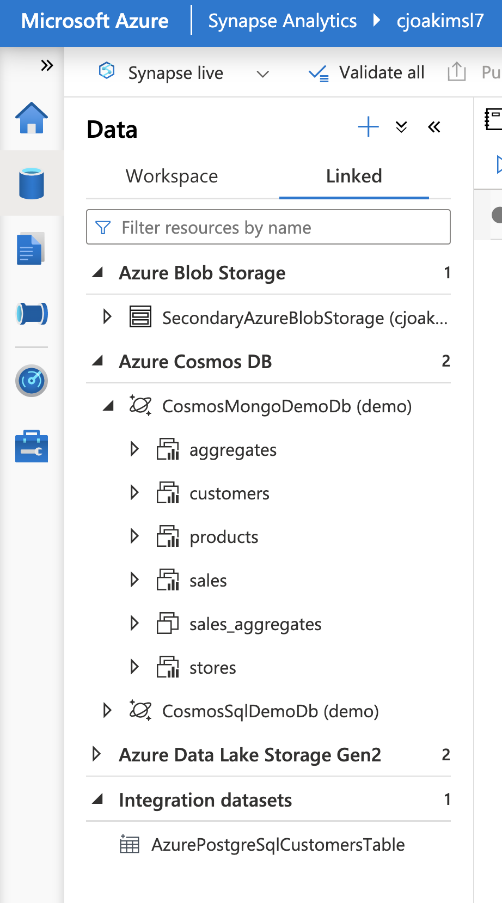
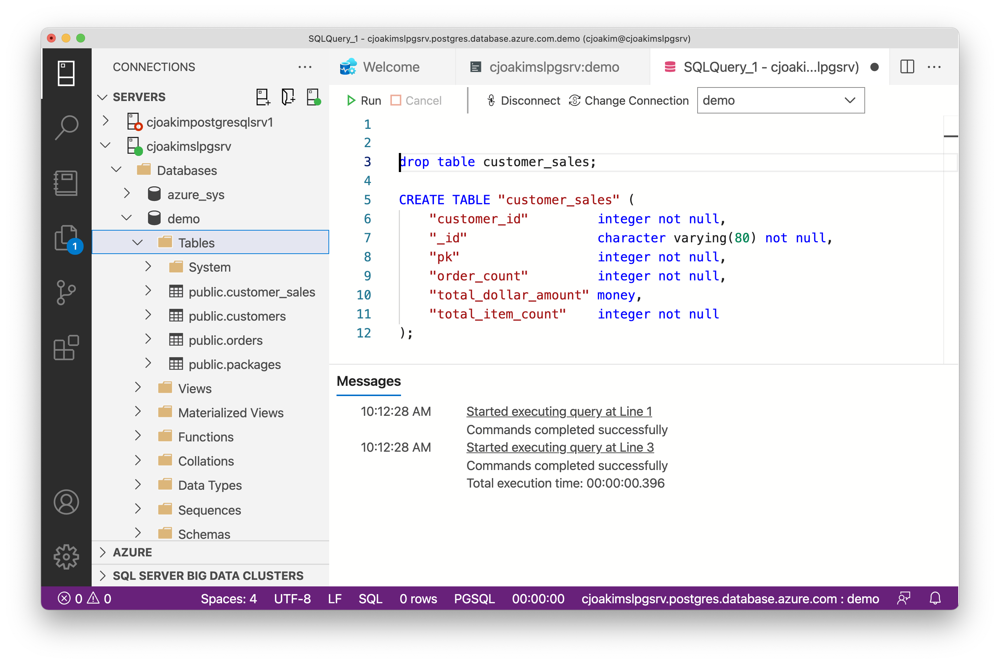

# Setup Synapse, Spark Pools, Libraries, PostgreSQL

Setup notes for Azure Synapse, the Spark Pool, and Azure PostgreSQL.

---

## Azure Synapse 

### Spark Workspace Packages 

See https://docs.microsoft.com/en-us/azure/synapse-analytics/spark/apache-spark-azure-portal-add-libraries regarding first adding additional
packages/libraries to your Synapse Workspace, then to your Spark Pools.

The three jar files in the screen shot below are available on 
[Maven Central](https://search.maven.org/), but they are also in this repo in the
Synapse/libraries/ directory.

In the example below, I'm adding three additional packages/libraries
to my Synapse workspace.

<p align="center">
    
</p>

---

### Spark Pool Packages 

Upload a Python **requirements.txt** file for **PySpark**, if necessary.

For example, this file can look like the following to add support for
[GraphFrames](https://pypi.org/project/graphframes/):

```
graphframes==0.6
```

Also add the necessary **Workspace Package** libraries (jar files) to your
Spark Pool as necessary.  

File **postgresql-42.3.2.jar** is the **JDBC Driver for Azure PostgreSQL**.

<p align="center">
    
</p>

---

### Spark Pool Configuration

You can extend the set of **spark.conf** entries with a simple text file
as shown below. 

Alternatively, some of these entries may be best implemented by using
**Azure Key Vault** as described here: 

- https://docs.microsoft.com/en-us/azure/synapse-analytics/spark/microsoft-spark-utilities?pivots=programming-language-scala
- https://docs.microsoft.com/en-us/azure/synapse-analytics/spark/apache-spark-secure-credentials-with-tokenlibrary

<p align="center">
    
</p>

#### Example spark_conf.txt

The naming convention used here, with the **spark.azurepg** prefix,
is simply my own naming convention - these aren't names that are
required for Synapse or the PostgreSQL Driver.

```
spark.azurepg.jdbc.connstring jdbc:postgresql://myserver.postgres.database.azure.com:5432/demo?user=user@myserver&password=xxxYYYzzz&sslmode=require
spark.azurepg.jdbc.driver     org.postgresql.Driver
spark.azurepg.jdbc.server     myserver
spark.azurepg.jdbc.database   demo
spark.azurepg.jdbc.user       user@myserver
spark.azurepg.jdbc.pass       xxxYYYzzz
```

---

### Azure Synapse Linked Services 

<p align="center">
    
</p>

---

## Azure PostgreSQL

Create a database called **demo** with the following tables:

### SQL DDL Scripts in this repo

You can execute these scripts in [Azure Data Studio](https://docs.microsoft.com/en-us/sql/azure-data-studio/download-azure-data-studio?) in this repo to create 
the necessary tables for this demo in your Azure PostgreSQL database.

```
Relational/PostgreSQL/sql/ecomm_customer_sales.sql
Relational/PostgreSQL/sql/ecomm_customers.sql
Relational/PostgreSQL/sql/ecomm_orders.sql
Relational/PostgreSQL/sql/packages.sql
```

### Example - ecomm_customer_sales.sql

```
drop table customer_sales;

CREATE TABLE "customer_sales" (
	"customer_id"         integer not null,
	"_id"                 character varying(80) not null,
	"pk"                  integer not null,
	"order_count"         integer not null,
	"total_dollar_amount" money,
	"total_item_count"    integer not null
);
```

#### Screen Shot - executing the above SQL in Azure Data Studio

<p align="center">
    
</p>

---

## Writing to Azure PostgreSQL from an Azure Synapse Notebook

The following Spark/Scala code demonstrates how to write to
a PostgreSQL table using the **org.postgresql.Driver** JDBC driver
in an Azure Synapse Notebook.

```
%%spark

val connStr  = spark.conf.get("spark.azurepg.jdbc.connstring")
val driver   = spark.conf.get("spark.azurepg.jdbc.driver")
val server   = spark.conf.get("spark.azurepg.jdbc.server")
val database = spark.conf.get("spark.azurepg.jdbc.database")
val table    = "public.customer_sales"
val user     = spark.conf.get("spark.azurepg.jdbc.user")
val password = spark.conf.get("spark.azurepg.jdbc.pass")

val df_temp_view = spark.read.table("CustomerAggSales")
df_temp_view.printSchema()

// Write the DataFrame to the PostgreSQL table using JDBC.

df_temp_view.write
  .format("jdbc")
  .option("url", connStr)
  .option("driver", driver)
  .option("dbtable", table)
  .option("user", user)
  .option("password", password)
  .mode("overwrite")
  .save()
```

For the full Notebook code, see file
Synapse/notebooks/cosmos_mongo_sales_processing.ipynb in this repo.
