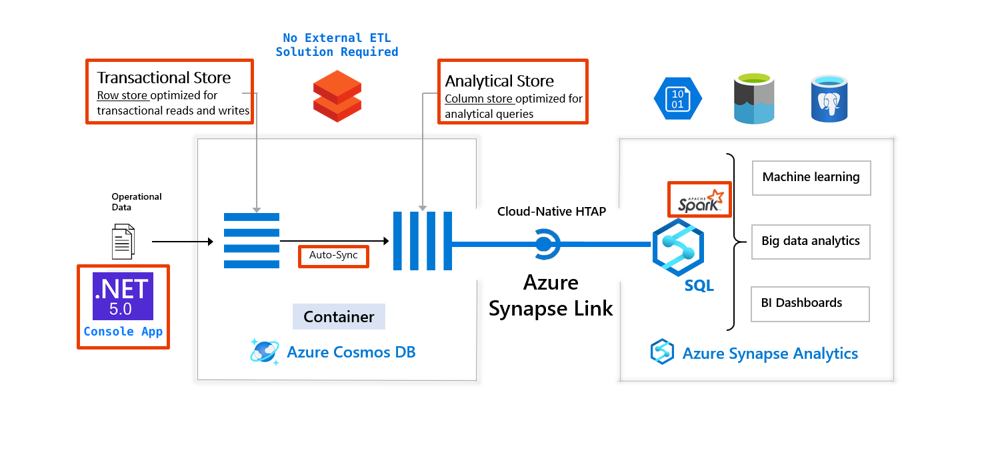
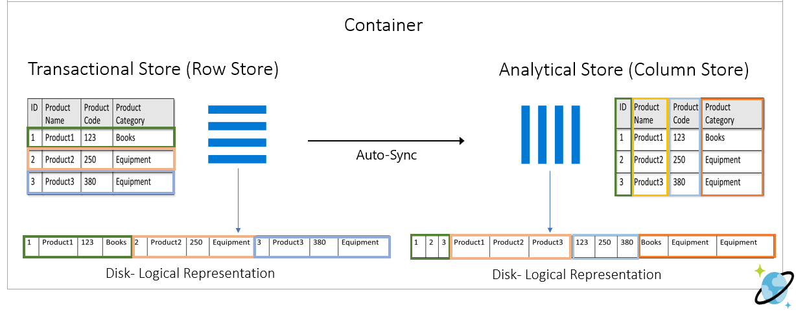

# azure-cosmosdb-synapse-link

Demonstration of Azure CosmosDB with Synapse Integration via Synapse Link

<p align="center"></p>

<p align="center"></p>

<p align="center"></p>

---

## This GitHub Repository

- https://github.com/cjoakim/azure-cosmosdb-synapse-link
- **Chris Joakim, Microsoft, chjoakim@microsoft.com, Americas Global Black Belt NoSQL/CosmosDB**

### Directory Structure

```
├── DotnetConsoleApp      <-- net5.0 console application
│   ├── data              <-- json and csv files, zipped
│   └── sql               <-- CosmosDB query sql file(s)
├── az                    <-- provisioning scripts using the az CLI
├── presentation
│   └── presentation.md   <-- primary presentation file
└── synapse
    └── pyspark           <-- pyspark notebooks for Azure Synapse
```

---

## Running this Demo in Your Azure Subscription

### Provision Azure Resources

Recommended that you provision with either the **Azure Portal** or the **az CLI**.

- **Azure CosmosDB Account, SQL API**
  - database named **demo**
  - container named **travel** with partition key **/pk**
  - both the account and the container should have the **Analytical Store Enabled**

- **Azure Synapse**
  - with a **small spark pool of only 3 nodes**

- **Azure Storage Account**
  - this is optional, used by one of the PySpark Notebooks

#### Provisioning with the az CLI

See script **az/create_all.sh** in this repo, and the instructions below/

Note: this repo currently has bash scripts implemented for linux or macOS.
Equivalent PowerShell scripts for Windows will be implemented soon.

### Laptop/Workstation Requirements

- Either Windows, macOS, or Linux
- git
- dotnet 5
- az CLI 

### Environment Varibles

The code in this repo uses the following environment variables.
You should set these on your system per your Azure resource values.

```
AZURE_SUBSCRIPTION_ID

AZURE_CSL_COSMOSDB_SQLDB_CONN_STRING
AZURE_CSL_COSMOSDB_SQLDB_KEY
AZURE_CSL_COSMOSDB_SQLDB_PREF_REGIONS
AZURE_CSL_COSMOSDB_SQLDB_URI

AZURE_SYNAPSE_USER
AZURE_SYNAPSE_PASS

AZURE_CSL_COSMOSDB_BULK_BATCH_SIZE=500
```

### Getting Started

```
$ git clone https://github.com/cjoakim/azure-cosmosdb-synapse-link.git

$ cd azure-cosmosdb-synapse-link

$ cd az

... edit file config.sh, in the az/ directory, to your Azure resource configuration

$ ./create_all.sh

$ cd ..

$ cd DotnetConsoleApp
$ dotnet restore               <-- install the dotnet packages from NuGet (i.e. - CosmosDB SDK)
$ dotnet build                 <-- compile the C# code

$ cd data
... unzip the two zip files    <-- the zip files contain csv and json files too large for GitHub
$ cd ..

$ dotnet run                   <-- displays the list of commands supported by Program.cs
```

### Populating CosmosDB with the DotNet Console App

```
$ mkdir out

$ dotnet run bulk_load_container demo travel route data/air_travel_departures.json 2
...
ListContainers - count 1
OK: container travel is present in db: demo
LoadContainer - db: demo, container: travel, infile: data/air_travel_departures.json, maxBatchCount: 2
writing batch 1 (500) at 1630186455833
writing batch 2 (500) at 1630186457831

EOJ Totals:
  Database:             demo
  Container:            travel
  Input Filename:       data/air_travel_departures.json
  Max Batch Count:      2
  BulkLoad startEpoch:  1630186455640
  BulkLoad finishEpoch: 1630186459215
  BulkLoad elapsedMs:   3575
  BulkLoad elapsedSec:  3.575
  BulkLoad elapsedMin:  0.059583333333333335
  Batch Size:           500
  Batch Count:          2
  Exceptions:           0
  Document/Task count:  1000
  Document per Second:  279.72027972027973
```

The above loads 2 batches (1000 documents) into the database named demo, the container
named travel, using the given json data file and the value of the route attribute as
the partition key.

Look at your CosmosDB account in Azure Portal to confirm that the documents were added.

You can use the DotNet program to count the documents with this command:

```
$ dotnet run count_documents demo travel 
```

You can run this process again to load the entire dataset by using a higher batch count
as shown below:

```
$ dotnet run bulk_load_container demo travel route data/air_travel_departures.json 999999
...


```

This load process can be run several times as necessary, and unique documents will be created
from the same input data.  This is enabled by this C# code that sets the **id attribute**
of each new document:

```
    jsonDoc.id = Guid.NewGuid().ToString();     <-- See Program.cs, method BulkLoadContainer
```


#### The Air Travel Data

Each line in file data/air_travel_departures.json contains a document that looks
similar to the following:

```
{
  "id": "a7a868a4-ff6f-11eb-96e6-acde48001122",
  "pk": "GUM:MAJ",
  "date": "2006/05/01",
  "year": "2006",
  "month": "5",
  "from_iata": "GUM",
  "to_iata": "MAJ",
  "airlineid": "20177",
  "carrier": "PFQ",
  "count": "10",
  "route": "GUM:MAJ",
  "from_airport_name": "Guam Intl",
  "from_airport_tz": "Pacific/Guam",
  "from_location": {
    "type": "Point",
    "coordinates": [
      144.795983,
      13.48345
    ]
  },
  "to_airport_name": "Marshall Islands Intl",
  "to_airport_country": "Marshall Islands",
  "to_airport_tz": "Pacific/Majuro",
  "to_location": {
    "type": "Point",
    "coordinates": [
      171.272022,
      7.064758
    ]
  },
  "doc_epoch": 1629214058.4217112
}
```

### Execute CosmosDB Queries with the DotNet Console App

```
$ mkdir out

$ dotnet run execute_queries demo travel sql/queries.txt

================================================================================
executing qname: q0, db: demo, cname: travel, sql: SELECT COUNT(1) FROM c
QueryResponse: q0 db: demo container: travel status: OK ru: 2.89 items: 1 excp: False
file written: out/q0_demo_travel.json

================================================================================
executing qname: q1, db: demo, cname: travel, sql: SELECT * FROM c WHERE c.pk = 'ATL:MBJ'
QueryResponse: q1 db: demo container: travel status: OK ru: 2.79 items: 0 excp: False
file written: out/q1_demo_travel.json

================================================================================
executing qname: q2, db: demo, cname: travel, sql: SELECT * FROM c WHERE c.pk = 'ATL:MBJ'
QueryResponse: q2 db: demo container: travel status: OK ru: 2.79 items: 0 excp: False
file written: out/q2_demo_travel.json

================================================================================
executing qname: q3, db: demo, cname: travel, sql: SELECT * FROM c WHERE c.pk = 'ATL:MBJ' offset 0 limit 5
QueryResponse: q3 db: demo container: travel status: OK ru: 2.79 items: 0 excp: False
file written: out/q3_demo_travel.json

================================================================================
executing qname: q4, db: demo, cname: travel, sql: SELECT * FROM c WHERE c.to_airport_country = 'Jamaica'
QueryResponse: q4 db: demo container: travel status: OK ru: 3.21 items: 11 excp: False
file written: out/q4_demo_travel.json
```

The query responses are written to JSON files in the out/ directory,
and the response status and RU charges are displayed in the console.

Edit file sql/queries.txt as necessary, to add your own queries.

