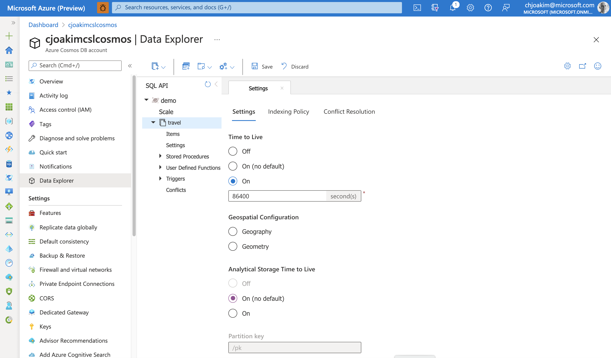
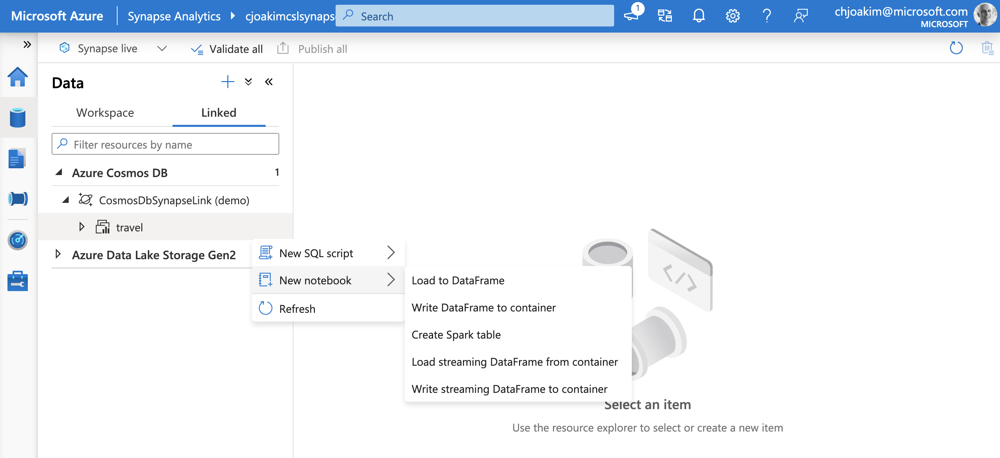
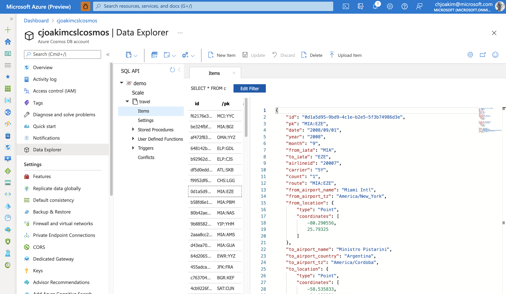
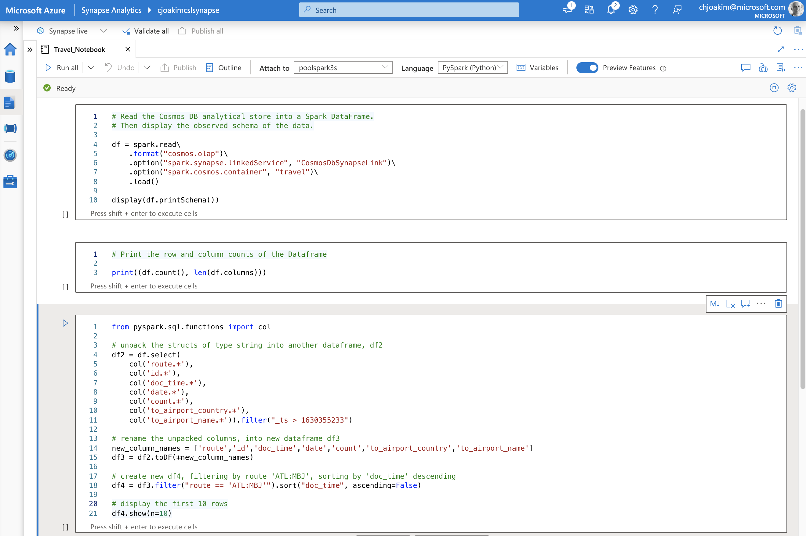
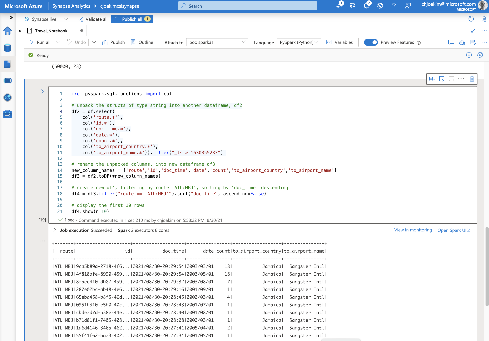

# azure-cosmosdb-synapse-link

Demonstration of **Azure CosmosDB** with **Azure Synapse Analytics**
integration via **Synapse Link**

**Chris Joakim, Microsoft, Global Black Belt NoSQL/CosmosDB**, chjoakim@microsoft.com

### Table of Contents

- [Part 1: Architecture of Synapse Link, and this Demonstration App](#part1)
- [Part 2: Setup this Demonstration App in Your Azure Subscription](#part2)
- [Part 3: Demonstration](#part3)
  - 3.1 Understand the International Air Travel Data
  - 3.2 Populate CosmosDB with the DotNet Console App
  - 3.3 Count the CosmosDB Documents with the DotNet Console App
  - 3.4 Query the CosmosDB Documents with the DotNet Console App
  - 3.5 Query the Synapse Link Data with a PySpark Notebook in Synapse

<p align="center"></p>

<a name="part1"></a>

## Part 1: Architecture of Synapse Link, and this Demonstration App

- A **net5.0 client program** reads a data file, and Bulk Loads JSON documents to CosmosDB
- The CosmosDB documents flow into **Synapse Link** in near realtime
- Synapse Link performs **both copy AND data transformation (to columnar format)** operations
- No other ETL solution is needed (i.e. - Databricks)
- Query the Synapse Link data with **PySpark Notebooks in Azure Synapse Analytics**


<p align="center"></p>

<p align="center"></p>

## Synapse Link data movement and transformation

- Synapse Link performs **both copy AND data transformation (to columnar format)** operations
- A **columnar datastore** is more suitable for analytical query processing
- The **inserts, updates, and deletes** to your operational data are automatically synced to analytical store
- Auto-sync latency is usually within 2 minutes, but up to 5 minutes
- Supported for the **Azure Cosmos DB SQL (Core)** API and **Azure Cosmos DB API for MongoDB** APIs

<p align="center"></p>

<p align="center"></p>

## Synapse Link Details

- **No impact to CosmosDB performance or RU costs**
- Is Scalable and Elastic
- The Synapse Link data can be queried in Azure Synapse Analytics by:
  - **Azure Synapse Spark pools**
    - Spark Streaming not yet supported
  - **Azure Synapse Serverless SQL pools** (not provisioned pools)
- Pricing consists of **storage and IO operations**
- Schema constraints:
  - Only the first 1000 document properties
  - Only the first 127 document nested levels
  - No explicit versioning, the schema is inferred
  - CosmosDB stores JSON
  - Attribute names are mormalized: {"id": 1, "Name": "fred", "name": "john"}
  - Addtibute names with odd characters: colons, semicolons, parens, =, etc
- Two Schema Types:
  - Well-defined 
    - Default option for SQL (CORE) API accounts
    - The schema, with datatypes, grows are documents are added
      - Non-conforming attributes are ignored
        - doc1: {"id": "1", "a":123}      <-- "a" is an integer, added to schema
        - doc2: {"id": "2", "a": "str"}   <-- "a" isn't an integer, ignored
  - Full Fidelity
    - Default option for Azure Cosmos DB API for MongoDB accounts
    - None of the above dataname normalization or datatype enforcement
    - Can be optionally be used by the SQL API
      - az cosmosdb create ... --analytical-storage-schema-type "FullFidelity" 

- See https://docs.microsoft.com/en-us/azure/cosmos-db/analytical-store-introduction

---

## Links / References

- [What is Azure Synapse Link for Azure Cosmos DB?](https://docs.microsoft.com/en-us/azure/cosmos-db/synapse-link)
- [Azure Cosmos DB](https://docs.microsoft.com/en-us/azure/cosmos-db/introduction)
- [Azure Synapse Analytics](https://azure.microsoft.com/en-us/services/synapse-analytics/)
- [Analytical Store Pricing](https://docs.microsoft.com/en-us/azure/cosmos-db/analytical-store-introduction#analytical-store-pricing)


Go to [Part 3: Demonstration](#part3)

<p align="center"></p>

<a name="part2"></a>

## Part 2: Setup this Demonstration App in Your Azure Subscription

### Laptop/Workstation/VM Requirements

- Either the Windows, Linux, or macOS operating system
- [git](https://git-scm.com/)
- [dotnet 5](https://dotnet.microsoft.com/download/dotnet/5.0)
- [az CLI](https://docs.microsoft.com/en-us/cli/azure/install-azure-cli)  

### Clone this GitHub Repository

```
$ cd <some-parent-directory>

$ git clone https://github.com/cjoakim/azure-cosmosdb-synapse-link.git

$ cd azure-cosmosdb-synapse-link
```

#### Directory Structure of this Repository

```
├── DotnetConsoleApp      <-- net5.0 console application
│   ├── data              <-- json and csv files, zipped
│   └── sql               <-- CosmosDB query sql file(s)
├── az                    <-- provisioning scripts using the az CLI
├── presentation
│   └── presentation.md   <-- primary presentation file
└── synapse
    └── pyspark           <-- pyspark notebooks for Azure Synapse
```

### Compile Code, Unzip Data Files

```
$ cd DotnetConsoleApp
$ dotnet restore               <-- install the dotnet packages from NuGet (i.e. - CosmosDB SDK)
$ dotnet build                 <-- compile the C# code

$ mkdir out

$ cd data
... unzip the two zip files    <-- the zip files contain csv and json files too large for GitHub
$ cd ..

$ dotnet run                   <-- displays the list of commands supported by Program.cs
...

Command-Line Examples:
dotnet run list_databases
dotnet run create_database <dbname> <shared-ru | 0>
dotnet run delete_database <dbname>
dotnet run update_database_throughput <dbname> <shared-ru>
---
dotnet run list_containers <dbname>
dotnet run create_container <dbname> <cname> <pk> <ru>
dotnet run update_container_throughput <dbname> <cname> <ru>
dotnet run update_container_indexing <dbname> <cname> <json-doc-infile>
dotnet run truncate_container <dbname> <cname>
dotnet run delete_container <dbname> <cname>
---
dotnet run bulk_load_container <dbname> <cname> <pk-attr> <json-rows-infile> <batch-count>
dotnet run bulk_load_container demo travel route data/air_travel_departures.json 1
---
dotnet run count_documents <dbname> <cname>
---
dotnet run execute_queries <dbname> <cname> <queries-file>
dotnet run delete_route <dbname> <cname> <route>
dotnet run delete_route demo travel CLT:MBJ
```

### Provision Azure Resources

It is recommended that you provision these Azure Resources with either the 
**Azure Portal** or the **az CLI**.  This repo contains working az CLI scripts.

- **Azure CosmosDB Account, SQL API**
  - database named **demo**
  - container named **travel** with partition key **/pk**
  - both the account and the container should have the **Analytical Store Enabled**

- **Azure Synapse**
  - with a **spark pool of three small nodes**

### Provision Resources with the az CLI

**If you provisioned resources in Azure Portal, you can skip this section.**

#### Setup the az CLI

```
$ cd az

$ az login 

$ az account set --subscription <your-subscription-id>

$ az account show

$ az extension add -n storage-preview
$ az extension add --name synapse
```

#### Initial Environment Varibles

Set these on your system as both the az CLI provisioning process,
and the DotNet program, will use them.

```
export AZURE_SUBSCRIPTION_ID=<your-chosen-azure-subscription-id>
export AZURE_SYNAPSE_USER=<your-specified-username>
export AZURE_SYNAPSE_PASS=<your-specified-strong-password>
export AZURE_CSL_COSMOSDB_BULK_BATCH_SIZE=500
```

#### Provisioning on Linux or macOS with the az CLI in bash scripts

First, edit file **config.sh** - this file specifies your Azure Region,
Resource Group, and Azure Resource configuration details.

**Please do a change-all on this script to change "cjoakim" to YOUR ID!**

```
$ ./create_all.sh
```

#### Provisioning on Windows with the az CLI in PowerShell scripts

**Note: The PowerShell scripts for Windows in this repo are currently under construction.  The az commands, however, are portable across OS platforms.**

### Additional Environment Varibles

After provisioning, see your **CosmosDB account Azure Portal** to get these values.

```
export AZURE_CSL_COSMOSDB_SQLDB_URI
export AZURE_CSL_COSMOSDB_SQLDB_KEY
export AZURE_CSL_COSMOSDB_SQLDB_CONN_STRING
export AZURE_CSL_COSMOSDB_SQLDB_PREF_REGIONS=eastus   <-- example value
```

### Your CosmosDB Settings in Azure Portal

Your account should look similar to the following:

<p align="center"></p>

Note: I set the Time To Live (TTL) on my container to 86,400 seconds.
This represents 24-hours, or 1-day (60 * 60 * 24).

### Configure Azure Synapse

- Create a Linked Service to the CosmosDB Synapse Link Data
- Right-mouse the CosmosDB Synapse Link Data ""travel" icon
- Create a Notebook PySpark Notebook that reads that data as a Dataframe

<p align="center"></p>

#### Edit the cells of the Notebook to look like the following

**Cell 1**:

```
# Read the Cosmos DB analytical store into a Spark DataFrame.
# Then display the observed schema of the data.

df = spark.read\
    .format("cosmos.olap")\
    .option("spark.synapse.linkedService", "CosmosDbSynapseLink")\
    .option("spark.cosmos.container", "travel")\
    .load()

display(df.printSchema())
```

**Cell 2**:

```
# Print the row and column counts of the Dataframe

print((df.count(), len(df.columns)))
```

**Cell 3**:

```
from pyspark.sql.functions import col

# unpack the structs of type string into another dataframe, df2
df2 = df.select(
    col('route.*'),
    col('id.*'),
    col('doc_time.*'),
    col('date.*'),
    col('count.*'),
    col('to_airport_country.*'),
    col('to_airport_name.*')).filter("_ts > 1630355233") 

# rename the unpacked columns, into new dataframe df3
new_column_names = ['route','id','doc_time','date','count','to_airport_country','to_airport_name']
df3 = df2.toDF(*new_column_names)

# create new df4, filtering by route 'ATL:MBJ', sorting by 'doc_time' descending
df4 = df3.filter("route == 'ATL:MBJ'").sort("doc_time", ascending=False)

# display the first 10 rows
df4.show(n=10)
```

<p align="center"></p>

<a name="part3"></a>

## Part 3: Demonstration

### 3.1 Understand the International Air Travel Data

Each line in file data/air_travel_departures.json contains a document that looks
logically similar to the following:

```
{
  "id": "a7a868a4-ff6f-11eb-96e6-acde48001122",
  "pk": "GUM:MAJ",
  "date": "2006/05/01",
  "year": "2006",
  "month": "5",
  "from_iata": "GUM",
  "to_iata": "MAJ",
  "airlineid": "20177",
  "carrier": "PFQ",
  "count": "10",
  "route": "GUM:MAJ",
  "from_airport_name": "Guam Intl",
  "from_airport_tz": "Pacific/Guam",
  "from_location": {
    "type": "Point",
    "coordinates": [
      144.795983,
      13.48345
    ]
  },
  "to_airport_name": "Marshall Islands Intl",
  "to_airport_country": "Marshall Islands",
  "to_airport_tz": "Pacific/Majuro",
  "to_location": {
    "type": "Point",
    "coordinates": [
      171.272022,
      7.064758
    ]
  },
  "doc_epoch": 1629214058.4217112
}
```

The DotNet program will overlay the **pk (partition key)** attribute,
**id**, **doc_epoch**, and **doc_time**.

```
  "pk": "BOS:STR",
  "id": "62c75c42-cc42-4450-b879-c06553bb5f5b",

  "doc_epoch": 1630355232669,
  "doc_time": "2021/08/30-20:27:12",
```

The PySpark Notebook in Synapse (described in section 3.5 below) will query these values and sort on **doc_time***.

---

### 3.2 Populate CosmosDB with the DotNet Console App

#### Populate the Database, using the DotNet SDK Bulk Loading functionality 

```
$ dotnet run bulk_load_container demo travel route data/air_travel_departures.json 100
...
writing batch 97 (500) at 1630433942464
{"id":"d772cb1b-c387-47a8-8a4c-6e36dbee1b7a","pk":"JFK:PUJ","date":"2002/01/01","year":"2002","month":"1","from_iata":"JFK","to_iata":"PUJ","airlineid":"20402","carrier":"MMQ","count":"1","route":"JFK:PUJ","from_airport_name":"John F Kennedy Intl","from_airport_tz":"America/New_York","from_location":{"type":"Point","coordinates":[-73.778925,40.639751]},"to_airport_name":"Punta Cana Intl","to_airport_country":"Dominican Republic","to_airport_tz":"America/Santo_Domingo","to_location":{"type":"Point","coordinates":[-68.363431,18.567367]},"doc_epoch":1630433944259,"doc_time":"2021/08/31-18:19:04"}
writing batch 98 (500) at 1630433944276
{"id":"237a1c82-892e-431e-8951-aeeaa01675b3","pk":"MIA:MAO","date":"2004/09/01","year":"2004","month":"9","from_iata":"MIA","to_iata":"MAO","airlineid":"20232","carrier":"A2","count":"1","route":"MIA:MAO","from_airport_name":"Miami Intl","from_airport_tz":"America/New_York","from_location":{"type":"Point","coordinates":[-80.290556,25.79325]},"to_airport_name":"Eduardo Gomes Intl","to_airport_country":"Brazil","to_airport_tz":"America/Boa_Vista","to_location":{"type":"Point","coordinates":[-60.049721,-3.038611]},"doc_epoch":1630433945805,"doc_time":"2021/08/31-18:19:05"}
writing batch 99 (500) at 1630433945821
{"id":"3702f43b-0122-451e-8771-440f0226295d","pk":"GUM:HND","date":"2005/08/01","year":"2005","month":"8","from_iata":"GUM","to_iata":"HND","airlineid":"20185","carrier":"JO","count":"58","route":"GUM:HND","from_airport_name":"Guam Intl","from_airport_tz":"Pacific/Guam","from_location":{"type":"Point","coordinates":[144.795983,13.48345]},"to_airport_name":"Tokyo Intl","to_airport_country":"Japan","to_airport_tz":"Asia/Tokyo","to_location":{"type":"Point","coordinates":[139.779694,35.552258]},"doc_epoch":1630433947562,"doc_time":"2021/08/31-18:19:07"}
writing batch 100 (500) at 1630433947566

EOJ Totals:
  Database:             demo
  Container:            travel
  Input Filename:       data\air_travel_departures.json
  Max Batch Count:      100
  BulkLoad startEpoch:  1630433782500
  BulkLoad finishEpoch: 1630433949112
  BulkLoad elapsedMs:   166612
  BulkLoad elapsedSec:  166.612
  BulkLoad elapsedMin:  2.7768666666666664
  Batch Size:           500
  Batch Count:          100
  Exceptions:           0
  Document/Task count:  50000
  Document per Second:  300.0984322857897
```

The above loads 100 batches (50,000 documents) into the database named demo, 
the container named travel, using the given json data file, and the value of the
route attribute as the partition key.

The last document in each batch (of 500) is logged to the output, and then
end-of-job totals are displayed.

This load process can be run several times as necessary, and unique documents 
will be created from the same input data.  This is enabled by this C# code that 
sets the **id attribute** of each new document to a Guid:

```
    jsonDoc.id = Guid.NewGuid().ToString();  <-- See Program.cs, method BulkLoadContainer
```

Look at your CosmosDB account in Azure Portal to confirm that the documents were added.

#### Load again, with just one batch of 500 documents

```
$ dotnet run bulk_load_container demo travel route data/air_travel_departures.json 1
uri: https://cjoakimcslcosmos.documents.azure.com:443/
ListContainers - count 1
OK: container travel is present in db: demo
LoadContainer - db: demo, container: travel, infile: data/air_travel_departures.json, maxBatchCount: 1
{"id":"8bd06536-51d2-4594-80d7-07cd0050f69b","pk":"MIA:MAO","date":"2001/04/01","year":"2001","month":"4","from_iata":"MIA","to_iata":"MAO","airlineid":"20149","carrier":"PRQ","count":"4","route":"MIA:MAO","from_airport_name":"Miami Intl","from_airport_tz":"America/New_York","from_location":{"type":"Point","coordinates":[-80.290556,25.79325]},"to_airport_name":"Eduardo Gomes Intl","to_airport_country":"Brazil","to_airport_tz":"America/Boa_Vista","to_location":{"type":"Point","coordinates":[-60.049721,-3.038611]},"doc_epoch":1630443291597,"doc_time":"2021/08/31-20:54:51"}
writing batch 1 (500) at 1630443291600

EOJ Totals:
  Database:             demo
  Container:            travel
  Input Filename:       data/air_travel_departures.json
  Max Batch Count:      1
  BulkLoad startEpoch:  1630443291452
  BulkLoad finishEpoch: 1630443293377
  BulkLoad elapsedMs:   1925
  BulkLoad elapsedSec:  1.925
  BulkLoad elapsedMin:  0.03208333333333333
  Batch Size:           500
  Batch Count:          1
  Exceptions:           0
  Document/Task count:  500
  Document per Second:  259.7402597402597
```

We're expecting 5 documents for route **MIA:MAO** in the first batch
of 500 documents.

```
$ head -500 data/air_travel_departures.json | grep MIA | grep MAO

{"id": "a7a8cd44-ff6f-11eb-96e6-acde48001122", "pk": "MIA:MAO", "date": "2010/04/01", "year": "2010", "month": "4", "from_iata": "MIA", "to_iata": "MAO", "airlineid": "19550", "carrier": "KE", "count": "3", "route": "MIA:MAO", "from_airport_name": "Miami Intl", "from_airport_tz": "America/New_York", "from_location": {"type": "Point", "coordinates": [-80.290556, 25.79325]}, "to_airport_name": "Eduardo Gomes Intl", "to_airport_country": "Brazil", "to_airport_tz": "America/Boa_Vista", "to_location": {"type": "Point", "coordinates": [-60.049721, -3.038611]}, "doc_epoch": 1629214058.424257}

{"id": "a7a90a84-ff6f-11eb-96e6-acde48001122", "pk": "MIA:MAO", "date": "2009/12/01", "year": "2009", "month": "12", "from_iata": "MIA", "to_iata": "MAO", "airlineid": "20377", "carrier": "X9", "count": "2", "route": "MIA:MAO", "from_airport_name": "Miami Intl", "from_airport_tz": "America/New_York", "from_location": {"type": "Point", "coordinates": [-80.290556, 25.79325]}, "to_airport_name": "Eduardo Gomes Intl", "to_airport_country": "Brazil", "to_airport_tz": "America/Boa_Vista", "to_location": {"type": "Point", "coordinates": [-60.049721, -3.038611]}, "doc_epoch": 1629214058.425824}

{"id": "a7a93ae0-ff6f-11eb-96e6-acde48001122", "pk": "MIA:MAO", "date": "2001/09/01", "year": "2001", "month": "9", "from_iata": "MIA", "to_iata": "MAO", "airlineid": "20193", "carrier": "GR", "count": "2", "route": "MIA:MAO", "from_airport_name": "Miami Intl", "from_airport_tz": "America/New_York", "from_location": {"type": "Point", "coordinates": [-80.290556, 25.79325]}, "to_airport_name": "Eduardo Gomes Intl", "to_airport_country": "Brazil", "to_airport_tz": "America/Boa_Vista", "to_location": {"type": "Point", "coordinates": [-60.049721, -3.038611]}, "doc_epoch": 1629214058.427063}

{"id": "a7a9f584-ff6f-11eb-96e6-acde48001122", "pk": "MIA:MAO", "date": "2006/11/01", "year": "2006", "month": "11", "from_iata": "MIA", "to_iata": "MAO", "airlineid": "20193", "carrier": "GR", "count": "2", "route": "MIA:MAO", "from_airport_name": "Miami Intl", "from_airport_tz": "America/New_York", "from_location": {"type": "Point", "coordinates": [-80.290556, 25.79325]}, "to_airport_name": "Eduardo Gomes Intl", "to_airport_country": "Brazil", "to_airport_tz": "America/Boa_Vista", "to_location": {"type": "Point", "coordinates": [-60.049721, -3.038611]}, "doc_epoch": 1629214058.4318411}

{"id": "a7aa388c-ff6f-11eb-96e6-acde48001122", "pk": "MIA:MAO", "date": "2001/04/01", "year": "2001", "month": "4", "from_iata": "MIA", "to_iata": "MAO", "airlineid": "20149", "carrier": "PRQ", "count": "4", "route": "MIA:MAO", "from_airport_name": "Miami Intl", "from_airport_tz": "America/New_York", "from_location": {"type": "Point", "coordinates": [-80.290556, 25.79325]}, "to_airport_name": "Eduardo Gomes Intl", "to_airport_country": "Brazil", "to_airport_tz": "America/Boa_Vista", "to_location": {"type": "Point", "coordinates": [-60.049721, -3.038611]}, "doc_epoch": 1629214058.433557}
```

In Azure Portal, query the latest **MIA:MAO** documents.
```
SELECT c.id, c.pk, c.doc_time FROM c WHERE c.pk = 'MIA:MAO' order by c.doc_time desc offset 0 limit 5
```

<p align="center"></p>

---

### 3.3 Count the CosmosDB Documents with the DotNet Console App

```
$ dotnet run count_documents demo travel

CountDocuments demo travel -> 50000
```

---

### 3.4 Query the CosmosDB Documents with the DotNet Console App

```
$ dotnet run execute_queries demo travel sql/queries.txt

================================================================================
executing qname: q0, db: demo, cname: travel, sql: SELECT COUNT(1) FROM c
QueryResponse: q0 db: demo container: travel status: OK ru: 2.89 items: 1 excp: False
file written: out/q0_demo_travel.json

================================================================================
executing qname: q1, db: demo, cname: travel, sql: SELECT c.id, c.pk, c.doc_time FROM c WHERE c.pk = 'MIA:MAO' order by c.doc_time desc offset 0 limit 5
QueryResponse: q1 db: demo container: travel status: OK ru: 9.61 items: 5 excp: False
file written: out/q1_demo_travel.json
```

The console output shows the query, the RU charge, and the number of items (documents)
returned.  See the output/xxx.json file for the actual query results.

Edit file sql/queries.txt as necessary, to add your own queries.

### 3.5 Query the Synapse Link Data with a PySpark Notebook in Synapse

#### Before execution

<p align="center"></p>

---

#### After execution

<p align="center"></p>
