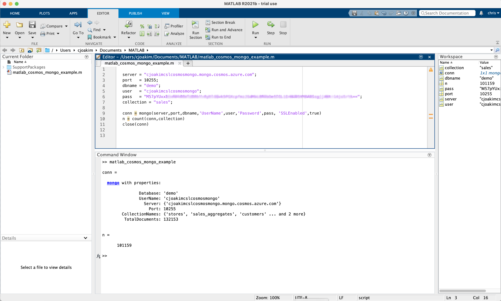
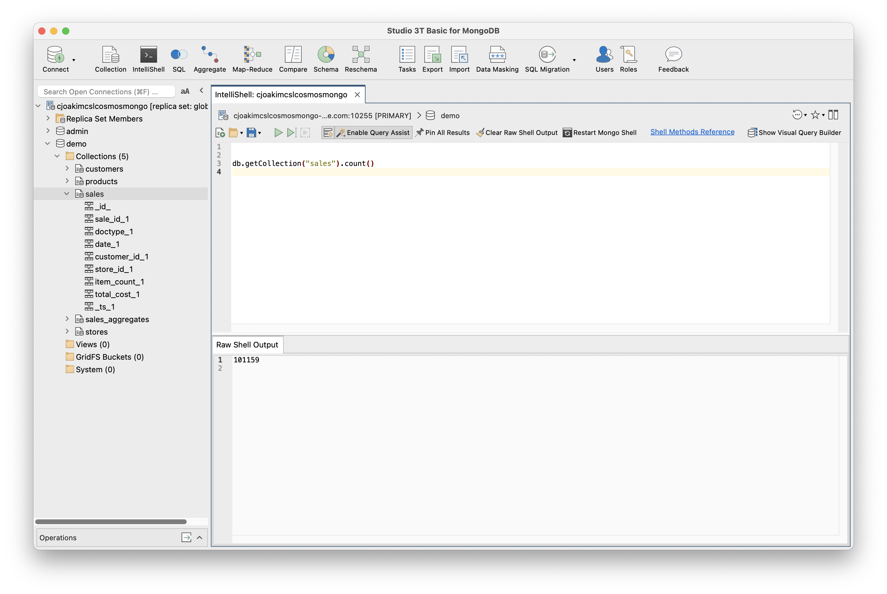
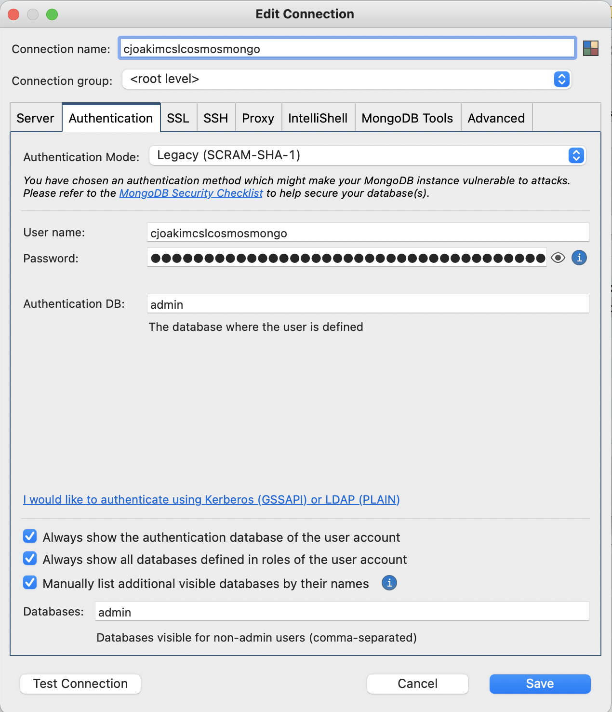
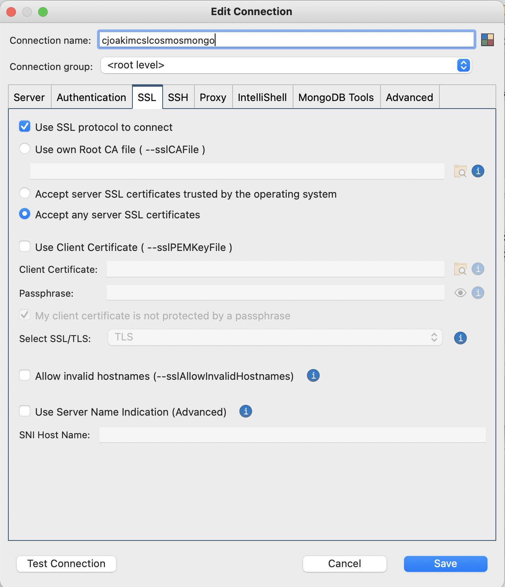

# CosmosDB/Mongo with Third Party Desktop Tools

## Matlab

### Documentation Links

- https://www.mathworks.com/products/get-matlab.html
- https://www.mathworks.com/help/database/ug/database-toolbox-interface-for-mongodb-installation.html
- https://www.mathworks.com/help/database/ug/mongo.html

### Example code

See Azure Portal for your CosmosDB/Mongo configuration values.

```
server = "cjoakimcslcosmosmongo.mongo.cosmos.azure.com";
port   = 10255;
dbname = "demo";
user   = "cjoakimcslcosmosmongo";
pass   = "M57pYUxx******************************************************************************==";
collection = "sales";

conn = mongo(server,port,dbname,'UserName',user,'Password',pass, 'SSLEnabled',true)

n = count(conn,collection)

close(conn)
```

### Screen Shot

<p align="center"></p>

---

## Studio 3T 

See https://studio3t.com/

### Screen Shots

#### Query 

<p align="center"></p>

#### Configuration

<p align="center"></p>

---

<p align="center"></p>

---

<p align="center"></p>
