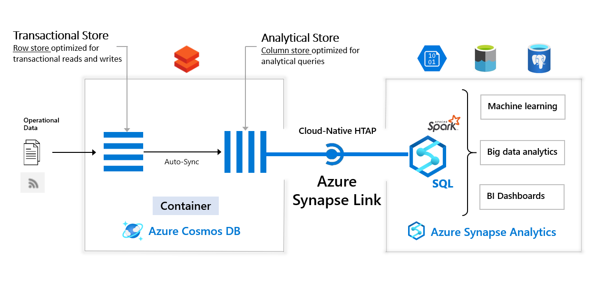

---

## Table of Contents

### 1. xxx

### 2. xxx

### 3. xxx

### 4. Demonstrate Synapse Link, and PySpark Queries of the Synapse Link Data

### 1. xxx

### 4. Demonstrate Synapse Link, and PySpark Queries of the Synapse Link Data

- https://github.com/Azure-Samples/Synapse/tree/main/Notebooks/PySpark/Synapse%20Link%20for%20Cosmos%20DB%20samples
- https://sparkbyexamples.com/pyspark/pyspark-structtype-and-structfield/

